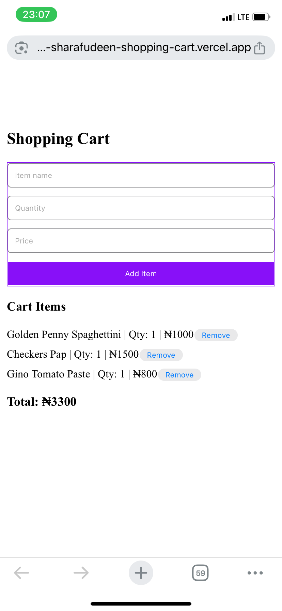

# Ecommerce-Shopping-Cart

## Project Overview
A simple web module to manage a shopping cart for an e-commerce application. Users can **add items, update quantities, remove items, and view cart contents**. The project demonstrates **dynamic UI updates, DOM manipulation, and responsive design**.

This project is ideal for learning frontend fundamentals and building **real-world web functionality**.

---

## Features
- **Add items** to the cart with a name, price, and quantity  
- **Update items** in the cart (change quantity or name)  
- **Remove items** from the cart  
- **Retrieve items** and display totals dynamically  
- **Basic responsive UI** for desktop and mobile screens  

---

## Tech Stack
- **HTML5**  
- **CSS3**  
- **JavaScript (ES6+)**  

---



---
## How to Run
1. Clone the repository:  
   ```bash
   git clone https://github.com/bintsharaf/Ecommerce-Shopping-Cart.git
2.	Open index.html in your web browser.
3.	Start adding, updating, and removing items in the shopping cart.
